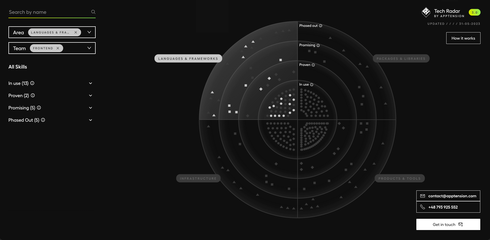
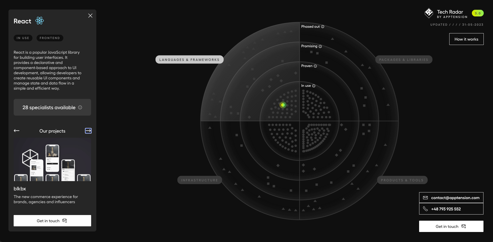

## Overview

Bootstrapped with [Create React App (by Apptension)](https://github.com/apptension/react-scripts-apptension).

The Tech Radar is a tool to support development teams at Apptension to pick the best technologies for new projects. It allows for knowledge and experience sharing, to reflect technology decisions and evolve our technology landscape.





## What is the Tech Radar?

The Tech Radar is a list of technologies along with their assessment result presented as 4 rings with the following meanings:

**Adopt** - Technologies we have high confidence in. Technologies with a usage culture in our production environment, low risk and recommended to be widely used.

**Trial** - Technologies that we have seen work with success in project work to solve a real problem; first serious usage experience that confirm benefits and can uncover limitations. Trial technologies are slightly more risky; some engineers in our organization walked this path and will share knowledge and experiences.

**Assess** - Technologies that are promising and have clear potential value-add for us; technologies worth to invest some research and prototyping efforts in to see if it has impact. Assess technologies have higher risks; they are often brand new and highly unproven in our organisation.

**Hold** - Technologies not recommended to be used for new projects. Technologies that we think are not (yet) worth to (further) invest in. Hold technologies should not be used for new projects, but usually can be continued for existing projects.

## Features

- Technical Radar with technologies in 4 categories and 4 adoption levels
- Search to filter out elements on the radar
- Filtering by adoption levels and teams who use specific technologies/tools
- Details view with logo, description, alternatives and links
- Mobile support

## Data source

Apptension Tech Radar uses Contentful CMS for data storage and will not work locally right from the start as required keys are not provided in the source code.

To connect your own Contentful space see `.env.example` file for required keys and `src/shared/hooks/useContentfulData.ts` along with `src/shared/services/api/contentful.ts` to see how we pull Contentful data currently.

Or connect your own preferable CMS or other data source.

For reference of data models used in the tech radar see types defined in `src/shared/components/radar/radar.types.ts`.

## Usage

### Node version

`>= 15.0.1`

`.nvmrc` file is added

### Run development environment

Install dependencies with yarn (or npm):

```Shell
yarn install
```

Run development server:

```Shell
yarn start
```

Open [http://localhost:3000](http://localhost:300) to view it in the browser.

The page will reload if you make edits.  
You will also see any lint errors in the console.

### Tag Version in the Title

The tag version in the title is taken from **package.json** file.

`"version": "2.0" => Tech Radar 2.0`

### Other available scripts

#### `yarn test`

Launches the test runner in the interactive watch mode.<br>
See the section about [running tests](https://facebook.github.io/create-react-app/docs/running-tests) for more information.

#### `yarn build`

Builds the app for production to the `build` folder.<br>
It correctly bundles React in production mode and optimizes the build for the best performance.

The build is minified and the filenames include the hashes.<br>
Your app is ready to be deployed!

See the section about [deployment](https://facebook.github.io/create-react-app/docs/deployment) for more information.

#### `yarn eject`

**Note: this is a one-way operation. Once you `eject`, you can’t go back!**

If you aren’t satisfied with the build tool and configuration choices, you can `eject` at any time. This command will remove the single build dependency from your project.

Instead, it will copy all the configuration files and the transitive dependencies (Webpack, Babel, ESLint, etc) right into your project so you have full control over them. All of the commands except `eject` will still work, but they will point to the copied scripts so you can tweak them. At this point, you’re on your own.

You don’t have to ever use `eject`. The curated feature set is suitable for small and middle deployments, and you shouldn’t feel obligated to use this feature. However, we understand that this tool wouldn’t be useful if you couldn’t customize it when you are ready for it.

#### `yarn extract-intl language1, language2, [...]`

Automatically generates `.json` files with messages gathered from the application.

#### `yarn lint`

Lints your JavaScript.

#### `yarn plop`

Generate Redux module (reducer, saga, selectors, action types, action creators, tests):

```Shell
yarn plop module
```

Generate Redux container and its react component in the specified path:

```Shell
yarn plop container
```

Generate React component (class or function) in the specified path

```Shell
yarn plop component
```

## Licence

© 2022 Apptension Sp. z o.o.

Built and maintained by Apptension.

Permission is hereby granted, free of charge, to any person obtaining a copy of this software and associated documentation files (the "Software"), to deal in the Software without restriction, including without limitation the rights to use, copy, modify, merge, publish, distribute, sublicense, and/or sell copies of the Software, and to permit persons to whom the Software is furnished to do so, subject to the following conditions:

The above copyright notice and this permission notice shall be included in all copies or substantial portions of the Software.

THE SOFTWARE IS PROVIDED "AS IS", WITHOUT WARRANTY OF ANY KIND, EXPRESS OR IMPLIED, INCLUDING BUT NOT LIMITED TO THE WARRANTIES OF MERCHANTABILITY, FITNESS FOR A PARTICULAR PURPOSE AND NON-INFRINGEMENT. IN NO EVENT SHALL THE AUTHORS OR COPYRIGHT HOLDERS BE LIABLE FOR ANY CLAIM, DAMAGES OR OTHER LIABILITY, WHETHER IN AN ACTION OF CONTRACT, TORT OR OTHERWISE, ARISING FROM, OUT OF OR IN CONNECTION WITH THE SOFTWARE OR THE USE OR OTHER DEALINGS IN THE SOFTWARE.
